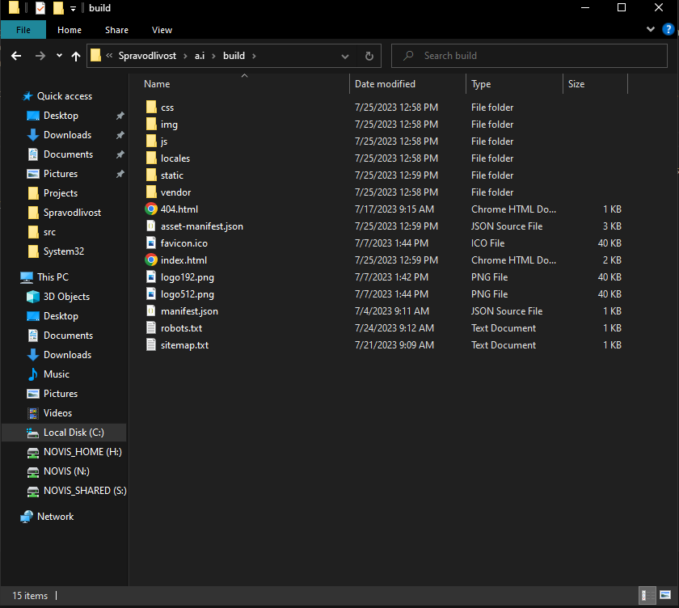
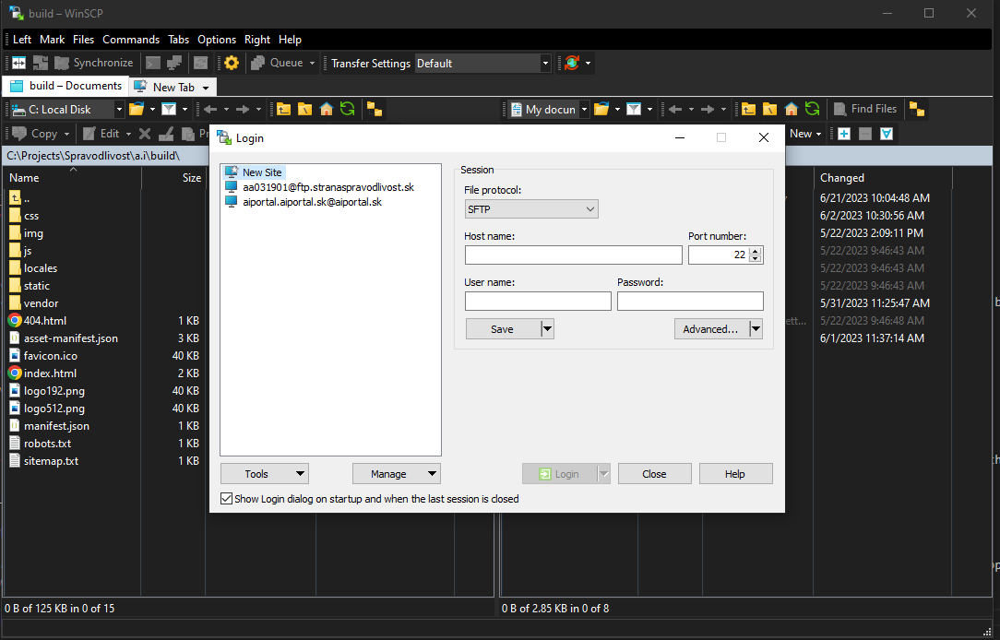
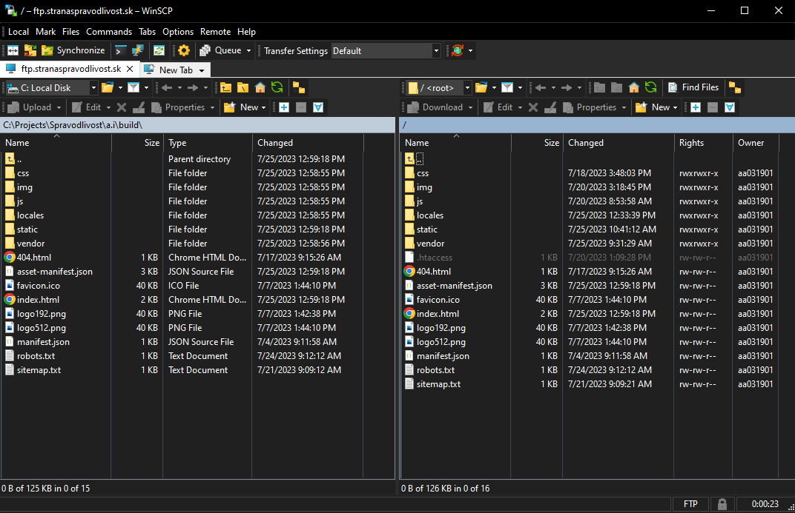

# Getting Started

First things first, you need to clone this project to your desired folder, and you have two options for cloning: using SSH or HTTP.
Cloning with HTTP:

1. To begin, create a new folder on your computer, and then proceed to open it using Visual Studio Code.
2. To initiate the process, open the terminal and simply paste the provided code: 
```sh
git clone http://185.65.222.7/a.i/a.i.git
```
3. After the cloning process is completed, navigate to the "a.i" folder by entering the following command in the command line:
```sh
cd a.i
```
4. Now, write the following command in the command line: 
```sh
npm install
```
(You can use either npx or yarn, depending on what you have installed).
Also, please ensure you have downloaded and installed Node.js on your PC to run this command successfully.
If the command does not work, consider adding --force at the end of the command to force execution as shown below:
```sh
npm install --force
```

In the project directory, you can run:

```sh
npm start
```

After completing the previous steps, you can now view the application in your browser [http://localhost:3000]
(it will likely open automatically). If everything appears to be correct, we can proceed with further work on the application.

## Ground Rules

1.	Feel free to create new files or folders within this project. However, please remember to maintain clear communication with other members who are also contributing to the project. Collaboration and coordination are essential to ensure a smooth and productive development process.
2.	Please refrain from editing or using documents that other members are currently working on. When files are merged, there is a possibility that previous or current changes to the document may be overwritten or deleted inadvertently. To avoid any conflicts or data loss, it is best to coordinate with your team and seek permission before making changes to shared documents. This ensures that everyone's contributions are valued and preserved throughout the collaborative process.
3.	Always remember to notify the main person in charge of this project whenever you make changes to the code or implement new features in the application. Their review and approval are crucial to maintain the project's integrity and ensure that the changes align with the overall vision and objectives. By keeping the main person informed, you promote a streamlined and organized development process, fostering better collaboration and a more successful outcome for the project as a whole.
4.  Once all changes have been thoroughly reviewed and confirmed to be functioning correctly, do not overlook the crucial step of pushing the changes. By pushing the changes to the designated repository, you ensure that the latest updates and improvements are shared with the entire team. This collaborative approach enables seamless synchronization and allows others to build upon your work, contributing to the project's overall progress.

When you have completed your work on the application, and all changes have been thoroughly reviewed and tested, it's time to run the build of the application. In the command line, type the following:
```sh
npm run build
```
The application build process may take a couple of minutes to complete. Once finished, you will notice a new folder within the "a.i" directory, resembling something like this: 



# Adding the built application to host

With the application successfully built and ready for publishing on a domain, the next step is to download a file transfer application. In this guide, we will demonstrate the process using the WinSCP application. However, feel free to choose any application that suits your preferences, such as FileZilla, Cyberduck, Core FTP, or others available.

1. Open the WinSCIP application



```sh

File_procotol: FTP
HOST_name: ftp.stranaspravodlivost.sk
Port_number: 21
user: *
password: *

(You will have to require the username and the password from the supervisor.)

```

2. Upon successful connection to the host using WinSCP or your chosen file transfer application, the interface will display something similar to this:



On the left side of the file transfer application, you will notice a display of your local folder structure. Navigate through the directories until you find the build folder, which should resemble the path you previously saw in the previous picture. Typically, the path will be something like "C://..x/x/a.i/build," but it may differ depending on where you have relocated your project folder.

## Rules When transfering

1. During the file transfer process, make sure to transfer all files and folders from the build directory to the hosting server, except for the ```vendor``` folder. The vendor folder should only be transferred under two specific circumstances:
    1. If you have installed a new plugin or added new dependencies to the application, then transfer the vendor folder to ensure all required packages are available on the server.
    2. If you have updated the project with new installations, which include changes to the vendor folder, then also transfer it to ensure the server has the latest version of the dependencies.
However, if none of the above conditions apply, refrain from transferring the vendor folder to avoid redundancy and unnecessary file transfers. This will help keep the deployment streamlined and avoid potential conflicts with existing packages on the server. By following this approach, you can ensure that your application is efficiently deployed and functions as intended on the domain.
2. When performing the file transfer, do not include the ```robots.txt``` file by default. The robots.txt file is used to communicate with web crawlers and instruct them on which parts of the website should be disallowed from indexing in search engines like Google. Only transfer the robots.txt file if you have added a new webpage or section on your website that you want to be disallowed from indexing by search engines. In such cases, ensure the updated robots.txt file is transferred to the hosting server, reflecting the changes you want to enforce for search engine crawlers. By carefully managing the inclusion of the robots.txt file during the transfer, you can control how search engines index your website's content and prevent certain pages from being displayed in search results if necessary.
3. Lastly, please do not transfer the ```sitemap.txt``` file unless you have added new webpages that need to be included in the sitemap. If you have made additions to the sitemap, ensure that the new pages are correctly listed alongside the existing ones. Take special care if the new pages contain special characters, such as "Technol%C3%B3gie" or "V%C3%BDskum%20a%20v%C3%BDvoj," as Google may encounter difficulties in indexing them. Be sure to make the necessary adjustments to the sitemap, so Google can accurately index the new pages without any issues.

The file transfer process may take a few minutes to complete. Once finished, you can proceed to test the newly deployed changes by visiting [https://stranaspravodlivost.sk/].

In some cases, the changes might not immediately reflect on the website. If you encounter this issue, try reloading the page a couple of times. If the changes still do not appear, consider clearing the cache from your browser. Cached data can sometimes prevent the latest updates from being displayed, so clearing the cache ensures that you are viewing the most recent version of the website.

By following these steps, you can confirm that the new changes have been successfully deployed and are visible on the live website. If you need further information or have any questions, please feel free to contact the supervisor. They will be able to provide additional guidance and assistance as needed. Happy testing!
